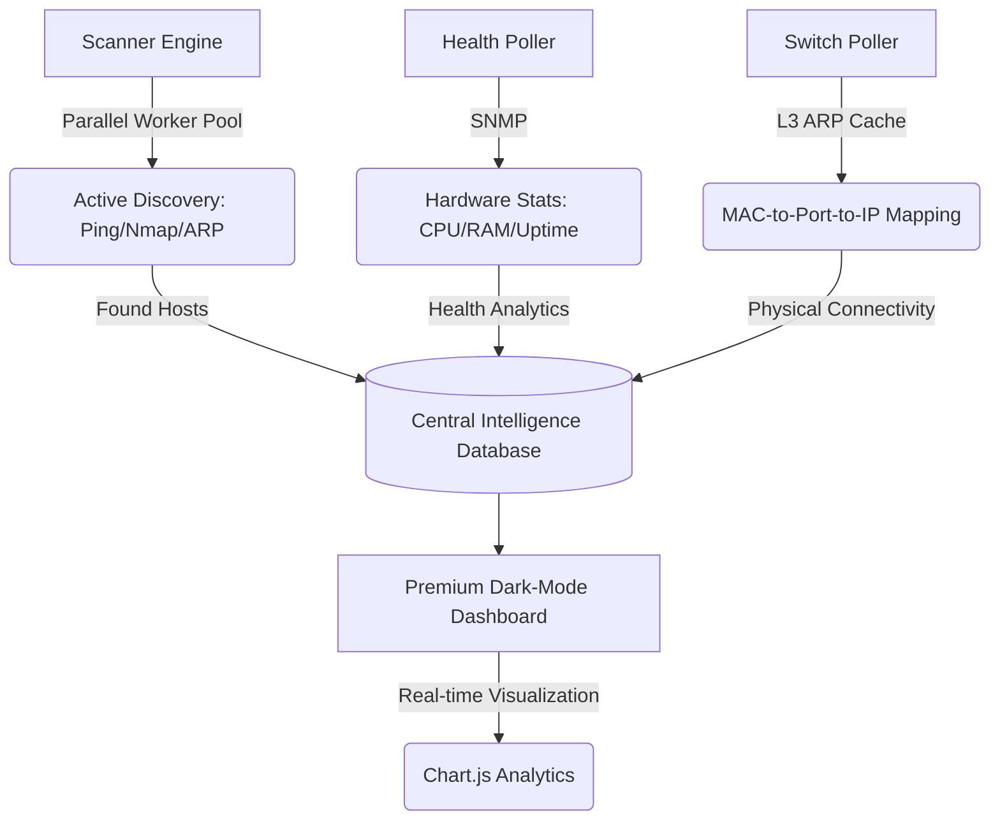

# 🚀 IPManager Pro: High-Performance Network Management

IPManager Pro is a state-of-the-art **IP Address Management (IPAM)** system and **Network Monitoring** platform. It is designed for high-density environments where accuracy, speed, and real-time visibility are critical.

Unlike standard IPAMs, IPManager Pro combines traditional inventory management with an **Active Discovery Engine** that tracks device health and location across your infrastructure.

---

## 🛠️ System Architecture & Workflow
How IPManager Pro maintains near 100% discovery accuracy:



---

## 📂 Core Modules & Menus
Discover the power of IPManager Pro through its specialized modules:

| Menu | Description | Key Features |
| :--- | :--- | :--- |
| **📊 Dashboard** | The command center of your network. | Live usage trends, subnet density, and overall health status. |
| **🌐 Managed Switches** | Deep-dive into your infrastructure hardware. | CPU/RAM gauges, system info, and full physical port mappings. |
| **🗺️ IP Management** | Logical organization of your network assets. | Flexible subnets, VLAN tracking, and IP allocation status. |
| **🧰 Network Toolbox** | Built-in professional diagnostic suite. | Real-time Ping, Traceroute, and MAC OUI vendor lookup. |
| **📜 Audit Logs** | Complete accountability and history. | Tracking of manual changes and automated system discoveries. |

---

## ⚡ The "Secret Sauce": Advanced Engines

### 1. Parallel Discovery Pool
Uses multi-process `proc_open` technology to scan thousands of IPs simultaneously across Windows and Linux, reducing scan times from hours to minutes.

### 2. High-Accuracy Switch Poller
Goes beyond standard SNMP. It uses vendor-specific OIDs (Cisco/MikroTik) and **L3 ARP Cache** analysis to link every connected device to its exact physical port and IP address.

### 3. Hardware Health Monitoring
Real-time tracking of hardware vitals (CPU, Memory, Uptime) ensures you know about infrastructure bottlenecks before they cause downtime.

---

## 📋 Technical Prerequisites
- **PHP 8.1+** (Extensions: `snmp`, `curl`, `pdo_mysql`, `mbstring`)
- **MariaDB 10.2+** / **MySQL 5.7+**
- **System Tools**: `nmap` and `traceroute` (for advanced diagnostics)

---

## 🚀 Installation & Deployment

### 🐳 Option A: Docker (Recommended)
The fastest way to deploy with all dependencies pre-configured.
```bash
docker-compose up -d
# Access at http://localhost:8080
```

### 🪟 Option B: XAMPP (Windows)
1. Copy files to `C:\xampp\htdocs\ipmanage`.
2. Enable `extension=snmp` and `extension=curl` in `php.ini`.
3. Import `sql/database.sql` via phpMyAdmin.
4. Access at `http://localhost/ipmanage`.

### 🐧 Option C: Linux Bare Metal (Ubuntu/Debian)
```bash
sudo apt install apache2 mariadb-server php-mysql php-snmp nmap traceroute
# Import database and configure /var/www/html/ipmanage
```

---

## 🤖 Automation (Background Tasks)
| Platform | Tool | Command / Description |
| :--- | :--- | :--- |
| **Docker** | Internal | Handled automatically by entrypoint scripts. |
| **Linux** | `crontab` | `*/15 * * * * php /path/to/cron_scanner.php` |
| **Windows** | Task Scheduler | Run `php.exe` with `cron_scanner.php` every 30 mins. |

---
*Powered by **Vanilla CSS**, **Lucide Icons**, and **Google Fonts (Outfit)** for a state-of-the-art UI experience.*
