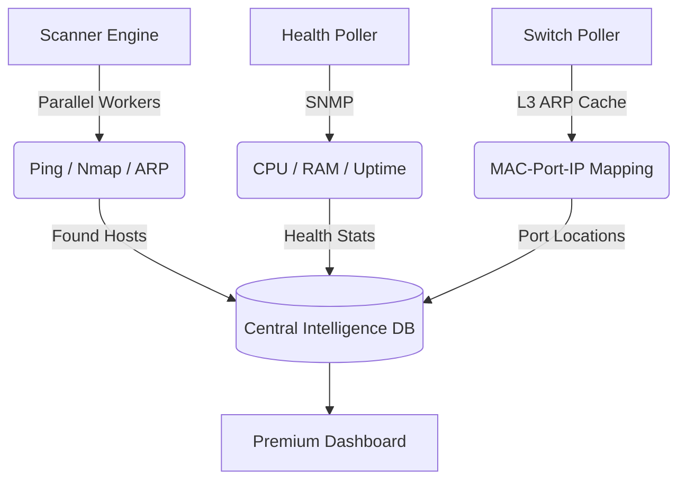

# 🚀 IPManager Pro: High-Performance IPAM & Network Monitoring

IPManager Pro is a modern, high-speed **IP Address Management (IPAM)** and **Infrastructure Monitoring** platform. It provides real-time visibility into your network subnets, device health, and physical connectivity.

---

## 🏗️ System Architecture
How IPManager Pro maintains its high-accuracy network map:

---

## 📂 Core Modules
| Module | Description |
| :--- | :--- |
| **📊 Dashboard** | Visual analytics, subnet density, and live usage trends. |
| **🌐 Switches** | Hardware monitoring (CPU/RAM) and physical port mapping. |
| **🗺️ IPAM** | Subnet organization, VLAN tracking, and IP allocation. |
| **🧰 Toolbox** | Professional diagnostics (Ping, Traceroute, MAC OUI Lookup). |
| **📜 Audit Logs** | Comprehensive history of all system and user changes. |

---

## 🔐 Default Credentials
Logout/Login at the initial screen using:
- **Username**: `admin`
- **Password**: `admin123`
*(Please change your password immediately after the first login)*

---

## ⚡ Installation Guide

### Option 1: Docker (Recommended)
1. Lihat [Panduan Instalasi Docker](DOCKER_INSTALL.md) untuk instruksi mendalam.
2. Jalankan perintah cepat: `docker-compose up -d`
3. Akses: `http://localhost:8080`

### Option 2: XAMPP (Windows)
1. Copy project to `C:\xampp\htdocs\ipmanage`.
2. **Setup PHP**: Edit `C:\xampp\php\php.ini`, remove `;` from `extension=snmp` and `extension=curl`.
3. **Database**: Create `ipmanage` in phpMyAdmin and import `sql/database.sql`.
4. Access: `http://localhost/ipmanage`

### Option 3: Linux (Ubuntu/Debian)
1. Install: `apt install apache2 mariadb-server php-mysql php-snmp nmap traceroute`.
2. Create DB and import `sql/database.sql`.
3. Set permissions: `chown -R www-data:www-data /var/www/html/ipmanage`.

---

## 🤖 Automation (Background Tasks)
| Platform | Requirement |
| :--- | :--- |
| **Docker** | Handled automatically. |
| **Linux** | `*/15 * * * * php /var/www/html/ipmanage/cron_scanner.php` (Crontab) |
| **Windows** | Set Task Scheduler to run `php.exe cron_scanner.php` every 30 mins. |

---

## 🛠️ Configuration
Custom settings (Database host, App URL, specific SNMP communities) can be modified in:
`includes/config.php`

---

## 👨‍💻 Author
**Habib Frambudi**

## ☕ Support the Project
If IPManager Pro has helped you optimize your network, consider buying me a coffee! Your support helps me maintain and add new features.

-   **Saweria (IDR)**: [saweria.co/Habibframbudi](https://saweria.co/Habibframbudi)
-   **PayPal (USD)**: `habibframbudi@gmail.com`

---
*Powered by **Vanilla CSS**, **Lucide Icons**, and **Chart.js**.*
