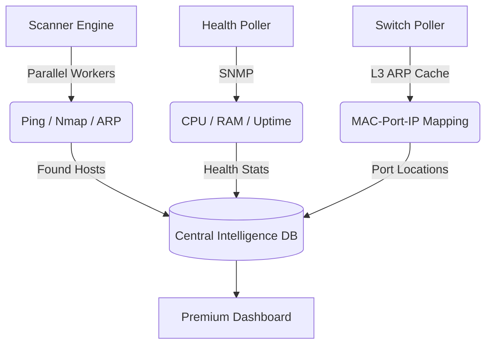

# 🚀 IPManager Pro: High-Performance IPAM & Network Monitoring

IPManager Pro is a modern, high-speed **IP Address Management (IPAM)** and **Infrastructure Monitoring** platform. It provides real-time visibility into your network subnets, device health, and physical connectivity.

---

## 🏗️ System Architecture
How IPManager Pro maintains its high-accuracy network map:

---

## ✨ Key Features

### 📡 Real-time Monitoring & Health
*   **Live SNMP Tracking**: Streaming data CPU, Memory, & Uptime secara realtime via *Server-Sent Events (SSE)*.
*   **Performance History**: Grafik Chart.js interaktif (1h ke 48h) untuk memantau beban perangkat secara historis.
*   **Device Health Badges**: Indikator status `LIVE` / `OFFLINE` otomatis pada dashboard.
*   **Detailed SysInfo**: Penarikan deskripsi sistem hardware secara mendalam langsung dari vendor (MikroTik, Cisco, Generic).

### 🔍 Advanced Discovery & IPAM
*   **Parallel Subnet Scanning**: Kecepatan tinggi dengan multiple background workers (ICMP + Nmap).
*   **L3 ARP Logic**: Discovery otomatis host melalui tabel ARP cache pada managed switch/router.
*   **Physical Port Mapping**: Melacak MAC Address hingga ke nomor port fisik switch secara akurat.
*   **VLAN Awareness**: Deteksi otomatis ID VLAN untuk setiap perangkat yang terhubung (Dot1q protocol).
*   **Anti-Ghost IP**: Mekanisme cerdas untuk membedakan host yang benar-benar offline dengan gangguan sementara (Auto-Cleanup).

### ⚡ Architecture & Performance
*   **Docker Optimized**: Setup satu baris dengan `docker-compose` yang sudah teruji untuk produksi.
*   **PHP Opcache**: Konfigurasi khusus untuk menghilangkan lag eksekusi PHP (2-3x lebih responsif).
*   **Redis Caching**: Penyimpanan session dan cache SNMP result di RAM untuk performa ultra-tinggi.
*   **Responsive UI**: Antarmuka modern (Dark Mode) yang ringan dan kompatibel dengan mobile browser.
*   **Dual-Config Mode**: Deteksi otomatis lingkungan kerja (Docker vs XAMPP) tanpa ubah kode.

### 🔐 Security & Audit
*   **Sanitized Schema**: Penggunaan database yang bersih dari data sensitif (tokens/passwords) untuk keamanan repo publik.
*   **Comprehensive Audit Logs**: Pencatatan setiap aksi user (Add, Edit, Delete, Poll) untuk akuntabilitas.
*   **RBAC Ready**: Dukungan dasar untuk role Admin dan Viewer.

---

## 📂 Core Modules
| Module | Description |
| :--- | :--- |
| **📊 Dashboard** | Visual analytics, subnet density, and live usage trends. |
| **🌐 Switches** | Hardware monitoring (CPU/RAM), physical port mapping, & VLAN detection. |
| **🗺️ IPAM** | Subnet organization, VLAN tracking, and IP allocation. |
| **🧰 Toolbox** | Professional diagnostics (Ping, Traceroute, MAC OUI Lookup). |
| **📜 Audit Logs** | Comprehensive history of all system and user changes. |

---

## 🔐 Default Credentials
Logout/Login at the initial screen using:
- **Username**: `admin`
- **Password**: `admin123`
*(Please change your password immediately after the first login)*

---

## ⚠️ Minimum Requirements (Recommended for No-Lag)
To ensure smooth realtime monitoring and high-speed parallel scanning, we recommend the following server specifications:

### Hardware
| Component | Minimum | Recommended |
| :--- | :--- | :--- |
| **CPU** | 1 vCPU (2.0GHz) | 2 vCPU+ (For parallel scan) |
| **RAM** | 1 GB Free RAM | 2 GB+ RAM |
| **Disk** | 5 GB SSD | 10 GB+ SSD |
| **Network** | 100 Mbps | 1 Gbps (Low latency SNMP) |

### Software
- **PHP**: 8.1 or 8.2 (with `php-snmp`, `php-curl`, `php-pdo_mysql`)
- **Database**: MariaDB 10.6+ or MySQL 8.0+
- **Tools**: `nmap`, `traceroute`, `snmp` (net-snmp)
- **Browser**: Modern Chrome / Edge / Firefox (For SSE & Chart.js)

---

## ⚡ Installation Guide

### Option 1: Docker (Recommended)
1. Lihat [Panduan Instalasi Docker](DOCKER_INSTALL.md) untuk instruksi mendalam.
2. Jalankan perintah cepat: `docker-compose up -d`
3. Akses: `http://localhost:2025`

### Option 2: XAMPP (Windows)
1. Copy project to `C:\xampp\htdocs\ipmanage`.
2. **Setup PHP**: Edit `C:\xampp\php\php.ini`, remove `;` from `extension=snmp` and `extension=curl`.
3. **Database**: Create `ipmanage` in phpMyAdmin and import `sql/database.sql`.
4. Access: `http://localhost/ipmanage`

### Option 3: Linux (Ubuntu/Debian)
1. Install: `apt install apache2 mariadb-server php-mysql php-snmp nmap traceroute`.
2. Create DB and import `sql/database.sql`.
3. Set permissions: `chown -R www-data:www-data /var/www/html/ipmanage`.

---

## 🤖 Automation (Background Tasks)
| Platform | Requirement |
| :--- | :--- |
| **Docker** | Handled automatically. |
| **Linux** | `*/15 * * * * php /var/www/html/ipmanage/cron_scanner.php` (Crontab) |
| **Windows** | Set Task Scheduler to run `php.exe cron_scanner.php` every 30 mins. |

---

## 🛠️ Configuration
Custom settings (Database host, App URL, specific SNMP communities) can be modified in:
`includes/config.php`

---

## 👨‍💻 Author
**Habib Frambudi**

## ☕ Support the Project
If IPManager Pro has helped you optimize your network, consider buying me a coffee! Your support helps me maintain and add new features.

-   **Saweria (IDR)**: [saweria.co/Habibframbudi](https://saweria.co/Habibframbudi)
-   **PayPal (USD)**: `habibframbudi@gmail.com`

---
*Powered by **Vanilla CSS**, **Lucide Icons**, and **Chart.js**.*
